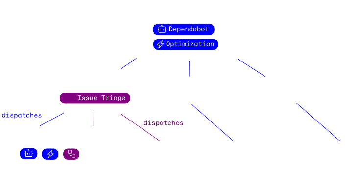

# Central Agentic Ops

> [!WARNING]
> This project is still experimental. Do not use until it is marked as ready and this notice is removed.

This repository contains the source for the Central Agentic Ops catalog, which is an opinioned set of GitHub Agentic Workflow bundles prescribed by GitHub. The catalog is designed to be installed in a private repository and run against configured target repositories across an enterprise.

This enables you to run [GitHub Agentic Workflows](https://github.github.com/gh-aw/) across an enterprise from private central control planes: Enterprise- and Organization-wide. Each control plane can run its own workflows against the same downstream repositories, while each target repository can still run its own workflows independently. The only difference is scope of target repositories they can reach:
- **Enterprise control** repository sits at a pre-defined enterprise level and can reach any configured repository across organizations.
- **Enterprise control** repository runs enterprise-shared AWs against configured repositories across organizations.
- **Organization control** repository can run additional organization-shared AWs against their own downstream repositories, while repositories can still run workflows specific to themselves.

<br>
<p align="center">
   
</p>
<br>

## What You Get

- **One control point:** shared authentication and safety policy for every installed bundle.
- **Gradual rollout:** every bundle starts in `staged`, can move through private `review`, and reaches `live` independently.
- **Controlled writes:** GitHub tools are read-only; worker workflows can write only through declared safe outputs.
- **Bounded execution:** orchestrator workflows choose repositories, while each worker workflow receives one target and cannot promote its own mode.
- **Traceable runs:** worker workflow safe outputs link back to the originating orchestrator workflow run.
- **Measured value:** packages include frozen per-worker outcome contracts under `.github/value-functions/` without installing the experimental authoring skill.
- **Operations report:** a conventional Pages workflow presents durable safe outputs, review bundles, and successful `noop` outcomes by installed bundle.

## Enterprise Deployment

Each workflow runs from the central repository that owns its policy and rollout:

<table>
   <thead>
      <tr>
         <th width="30%">Workflow scope</th>
         <th>How it runs</th>
      </tr>
   </thead>
   <tbody>
      <tr>
         <td><strong>Enterprise-shared AW</strong></td>
         <td>Runs in an enterprise-operated central control repository and dispatches per-repository workers against configured targets across organizations.</td>
      </tr>
      <tr>
         <td><strong>Organization-shared AW</strong></td>
         <td>Runs in an organization-operated central control repository and dispatches per-repository workers against configured targets in that organization.</td>
      </tr>
      <tr>
         <td><strong>Repository-local AW</strong></td>
         <td>Runs in the repository that owns it and is outside this control plane unless explicitly enrolled.</td>
      </tr>
   </tbody>
</table>

The Orchestrator and worker workflow definitions stay in their central control repository. A worker workflow checks out one target repository and sends declared safe outputs, such as an issue or pull request, to the configured destination. Target repositories do not receive installed copies of the enterprise-shared or organization-shared workflows.

An enterprise control repository and an organization control repository may both target the same downstream repository. Each source keeps its own credentials, rollout mode, review destination, correlation data, and safe-output limits.

## Control Boundary

Central Agentic Ops governs workflows run through its central control repositories. It does not prevent people, repositories, or other automation from creating or running workflows outside the catalog, and it does not make the control plane the only path for GitHub Actions execution.

Enterprises that require mandatory enforcement must pair it with GitHub-native controls such as Actions policies, repository rulesets, protected environments, required reviews for workflow changes, least-privilege App installations, and restricted administration. See [What This Does Not Do](docs/architecture.md#what-this-does-not-do).

## How It Works

1. **Install** the full catalog or one bundle into a private control-plane repository.
2. **Authenticate** with a GitHub App (preferred) or fine-grained PAT for private or write access; public staged scans can use the built-in workflow token.
3. **Validate** against one repository in `staged`, then route proposals to a private repository in `review`.
4. **Promote** only the proven bundle to `live`; other bundles keep their own modes.

| Mode | Effect |
| --- | --- |
| `staged` | Run in staged mode: generate safe outputs without GitHub API writes |
| `review` | Route safe outputs to the control-plane repository by default, or to an explicit private review repository |
| `live` | Allow declared worker workflow safe outputs to update the selected target |

## Quick Start

1. Install the [GitHub CLI](https://cli.github.com/), authenticate, and install `gh aw`:

   ```bash
   gh auth login
   gh extension install github/gh-aw
   ```

2. Create a new private repository for the control plane, clone it, and run `gh aw init` in the clone. For enterprise scope, create it in the designated organization that hosts the enterprise control repository.

3. Install the full catalog. Replace `<catalog-release>` with an exact release tag:

   ```bash
   gh aw add-wizard githubnext/central-agentic-ops@<catalog-release>
   ```

   Install a single capability as follows:

   ```bash
   gh aw add-wizard githubnext/central-agentic-ops/dependabot@<catalog-release>
   gh aw add-wizard githubnext/central-agentic-ops/optimization@<catalog-release>
   ```

   The core catalog installs no Pages workflow or `pages: write` capability. Add the optional Pages view only to a private, access-controlled control repository:

   ```bash
   gh aw add-wizard githubnext/central-agentic-ops/pages@<catalog-release>
   ```

The installer prompts for authentication and leaves every bundle in `staged`. Use a GitHub App through `GH_AW_GITHUB_APP_ID` and `GH_AW_GITHUB_APP_PRIVATE_KEY` (preferred), or a fine-grained PAT through `GH_AW_GITHUB_TOKEN`. When both are configured, App tokens take precedence. For public repositories only, staged scans can omit both and use the automatically provided `GITHUB_TOKEN`; private targets and cross-repository writes still require an App or PAT.

The optional **Pages** add-on installs the conventional publisher and trusted renderer. Before adding it, enable GitHub Pages with **GitHub Actions** as the source and verify that the control repository and its Pages site are private and access-controlled. The core catalog does not install or grant Pages publication capability.

## Control Plan

Start with the [control plan](docs/README.md), or go directly to:

- [Install and operate](docs/operations.md)
- [Configure variables, secrets, and run inputs](docs/configuration.md)
- [Configure authentication](docs/authentication.md)
- [Promote or roll back a bundle](docs/rollout-and-routing.md)
- [Understand the architecture](docs/architecture.md)
- [Add an orchestrator or worker](docs/orchestrators-and-workers.md)
