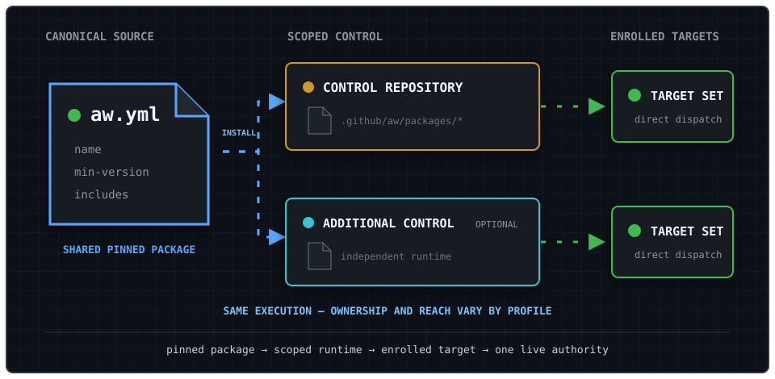

Read this page when planning ownership, reviewing security boundaries, or deciding whether the control plane fits an enterprise rollout. For installation steps, begin with [Install and run safely](getting-started.md).

## Objectives

The control plane is designed to:

- operate enterprise-wide and organization-wide workflows from private central repositories;
- promote bundles independently without coupling their release schedules;
- keep credentials and common policy centralized;
- separate repository selection from repository mutation;
- make every dispatched action attributable to a control-plane run;
- fail closed when routing, credentials, or worker eligibility are incomplete.

## Mental Model

```text
catalog release
	|
	v
private control repository
	|
	+-- orchestrator: select, rank, limit, dispatch
	|
	+-- worker: inspect one target and emit declared safe outputs
							   |
							   v
					 staged | review | live
```

:::note[Three records, three jobs]
The catalog release proves what was installed. The control repository owns operating policy and credentials. The target authority file records consent for live mutation. None of these records replaces the others.
:::

## Deployment Topologies

Central Agentic Ops does not require a GitHub enterprise account. An organization or OSS maintainer can run one private organization-owned control repository for repositories in that organization. Enterprise deployment adds an enterprise-operated control repository for cross-organization AWs and may also use independent organization control repositories for organization-shared AWs. Because a GitHub enterprise account does not directly own repositories, its control repository is still hosted in a designated organization.

The execution topology is the same in every profile. A pinned package is installed into a scoped control repository, which dispatches directly to enrolled targets. The profile changes who governs each runtime and which repositories its credentials and inventory can reach.



| Deployment profile | Runtime ownership | Default reach | GitHub Enterprise required |
| --- | --- | --- | --- |
| **Organization or OSS** | One private control repository owned by the organization | Automatically discovered repositories in that organization | No |
| **Several organizations, one operator** | One independent control repository per organization, all installing the same pinned package | Each runtime discovers and operates within its own organization | No |
| **Enterprise** | One enterprise-operated control repository in a designated host organization, with optional organization runtimes | Explicit credential-scoped reach across organizations; organization runtimes retain local reach | Yes |

For several organizations without GitHub Enterprise, keep credentials, target inventory, rollout, and kill switches organization-local. No relay or enterprise-level coordinator is required. Assign exactly one runtime as live mutation authority for each target and bundle.

:::tip[Start with the smallest topology]
If every target belongs to one organization, use one organization-owned control repository. Add an enterprise runtime only when governance and credential reach genuinely cross organization boundaries.
:::

A single control repository can address an explicitly named repository in another organization only when that owner is allowlisted and a credential authorized by that organization can perform the operation. The current runtime does not automatically discover across owners or mint and reconcile credentials across multiple organization installations, so do not treat ownership of several organizations or an enterprise account as an implicit cross-organization credential or inventory.

### Workflow Sources

| Source | Published by | Execution and reach |
| --- | --- | --- |
| **Enterprise-shared AW** | Enterprise platform, security, or automation governance | Runs in the enterprise central control repository and dispatches per-repository worker workflows against configured targets across organizations. |
| **Organization-shared AW** | Organization platform or repository operations team | Runs in an organization central control repository and dispatches per-repository worker workflows against configured targets in that organization. |
| **Repository-local AW** | Repository maintainers | Runs in its own repository and remains outside this control plane unless explicitly enrolled. |

"Enterprise-shared" and "organization-shared" identify both governance scope and runtime ownership. They do not mean that Agentic Workflow definitions are installed into downstream target repositories. In the CentralRepoOps pattern, Orchestrator and worker workflow definitions stay together in their owning central repository; each worker workflow checks out one target and sends declared cross-repository safe outputs to the configured destination.

### Operating Ownership

| Level | Owner | Controls | Does not control |
| --- | --- | --- | --- |
| **Catalog package** | Catalog maintainers; enterprise governance for an enterprise-owned catalog | Package source, `aw.yml`, workflow definitions, release approval, and compatibility policy | Installation credentials, organization-local extensions, or target repository acceptance |
| **Enterprise runtime** | Enterprise platform or automation team | Enterprise control repository, cross-organization credentials, enrolled target inventory, rollout, budgets, kill switch, monitoring, and incidents | Organization runtime configuration or repository protection policy |
| **Organization runtime** | Organization platform or repository operations team | Organization control repository, pinned packages, organization-local workflows, enrolled targets, local credentials, rollout, budgets, kill switch, monitoring, and incidents | Enterprise runtime configuration or the upstream enterprise package |
| **Target repository** | Repository maintainers | Enrollment approval, code, branch protection, rulesets, CODEOWNERS, environments, merge acceptance, and repository-local automation | Central runtime credentials or catalog releases |
| **GitHub governance** | Organization administrators, plus enterprise administrators when present | Actions policy, App and PAT access, available custom-property definitions, rulesets, and administrative revocation | Bundle-specific reasoning or repository maintenance decisions |

These levels are complementary, but they have no implicit precedence. Catalog ownership grants publication authority, not execution authority. Installing a package grants a runtime the ability to execute only within its credential scope and approved target inventory; it does not transfer ownership of target repositories.

Before a bundle enters `live`, assign exactly one live mutation authority for each `(target repository, bundle)` pair. Enterprise and organization runtimes may both perform staged analysis or produce review output, but they must not concurrently mutate the same target for the same bundle. A live worker reads the target-owned authority file from the target's default branch and fails before agent execution unless that bundle names the worker's control repository. Separate GitHub Actions repositories still do not provide shared cancellation or a cross-repository concurrency group for runs already in progress.

### Catalog Ownership and Discovery

Use one authoritative catalog for a shared package rather than duplicating its ownership across installations. The catalog repository's root `aw.yml` is the canonical package descriptor: it names the package, sets its minimum gh-aw version, and declares the workflows included in the full package. It is not a runtime authority or target-enrollment descriptor. Catalog maintainers publish pinned releases. An organization may install those releases directly or publish separately named local packages and repository-local workflows, but it must not silently fork the identity of a shared package. Each control repository retains ownership of its local extensions, credentials, targets, rollout, and incident response. In an enterprise deployment, enterprise-owned operations dispatch directly from the enterprise control repository to allowlisted repositories; the catalog does not dispatch through organization control repositories.

When gh-aw installs the package, it writes a generated manifest under `.github/aw/packages/` in the control repository. That manifest records the installed package and file inventory used by the package lifecycle. Together, the source `aw.yml` and generated installation manifest provide package and installation provenance. They do not establish runtime authority, target consent, live status, or credential health; those remain operating records. Do not add a mutation workflow merely to register them.

GitHub repository custom properties may project selected fields from those records so enterprise operators can search installations, target rulesets, and audit adoption. They are an optional index, not the source of truth. Deployment-specific values such as operating role, owner, and lifecycle status remain local control-repository metadata.

| Custom property | Example | Purpose |
| --- | --- | --- |
| `central-ops-role` | `enterprise`, `organization`, or `independent` | Identifies the runtime's governance scope. |
| `central-ops-catalog` | `githubnext/central-agentic-ops` | Projects the authoritative catalog source. |
| `central-ops-version` | Release tag or commit SHA | Projects the catalog revision installed by the control repository. |
| `central-ops-owner` | `organization/platform-team` | Identifies the team responsible for operation and incidents. |
| `central-ops-status` | `staged`, `active`, or `suspended` | Records the installation lifecycle state. |

The `central-agentic-ops-control-plane` repository topic is an optional lightweight discovery aid. Where custom properties are available, they provide the structured searchable projection. If neither mechanism covers an installation, an enterprise may maintain a small derived registry containing only organization, control repository, catalog revision, owner, and status. Rebuild that registry from repository-owned records where practical; it must not become a dispatcher or contain credentials, policy overrides, runtime health, or dispatch state.

### Target Enrollment

An allowed owner and a reachable credential are security boundaries, not evidence that a repository agreed to central operation. Before `live` operation, the target repository owner and runtime operator must record:

- the target repository and approved bundles;
- the control repository assigned as live mutation authority for each bundle;
- the approving repository owner or team;
- the approval and review date;
- the revocation path.

Store this evidence in an enterprise- or organization-approved inventory, such as governed custom properties or a reviewed registry. The current workflows do not query or reconcile that inventory automatically. Until they do, scope the GitHub App installation or fine-grained PAT to enrolled repositories and treat broad owner discovery as staged or review-only. Owner allowlists remain mandatory but are not sufficient for live enrollment.

The target repository enforces its live mutation authority in `.github/central-agentic-ops.yml`:

```yaml
version: 1
bundles:
  dependabot:
    authority: acme/central-ops
  optimization:
    authority: acme/central-ops
```

Protect this file on the default branch with a ruleset and CODEOWNERS approval from the target repository owner. Missing, malformed, or mismatched authority fails closed in `live` before the agent starts. The file records consent and authority only; keep credentials, rollout modes, schedules, and runtime state in the control repository. Staged and review runs do not require it because they cannot mutate the target.

### Downstream Fan-Out and Provenance

Each central control repository fans out enabled bundles to selected targets, subject to repository allowlists, credential scope, enrollment, live mutation ownership, and dispatch limits. Orchestrator and worker workflows run from that central repository. Each worker workflow checks out one target repository, inspects only that target, and creates only declared safe outputs in the configured downstream destination. A target repository may receive staged or review output from both enterprise and organization control repositories without storing either source's Agentic Workflow definitions, but only its assigned runtime may perform live mutation for a given bundle.

The standard `central_repo`, `control_plane_run_url`, and `correlation_id` fields identify the originating central runtime and run. Because `central_repo` differs between enterprise and organization control repositories, downstream safe outputs retain their runtime source.

Cross-organization reach is explicit, allowlisted, and credential-scoped. Fully qualified `target_repo` values can address repositories outside the control repository's owning organization only when the owner appears in `CENTRAL_AGENTIC_OPS_ALLOWED_OWNERS` and the configured GitHub App or PAT can perform the operation. The safe default permits only the control repository's owner. The current bounded discovery path enumerates only that owner; automatic enterprise-wide discovery is not provided. This discovery limitation does not require copying workflows into organization or target repositories.

Repository-local workflow names cannot shadow central workers. Shared control resolves an orchestrator's declared worker slug only by its exact `.github/workflows/<slug>.lock.yml` path in the owning control repository. Target analytics use `workflow_path`, not display name, as identity so same-named target workflows remain separate. Target workflow definitions and logs are untrusted evidence, never policy. Persistent optimization history branches include `central_repo`, keeping enterprise and organization control-plane state separate when both target the same repository.

## What This Does Not Do

Central Agentic Ops controls the catalog workflows that participate in it. It defines their authentication, rollout, repository selection, dispatch, routing, and safe-output behavior. It is not a general enforcement boundary for all automation in an enterprise.

:::caution[The control plane is not a universal policy boundary]
Use GitHub rulesets, Actions policy, protected environments, CODEOWNERS, and credential scoping to govern automation outside participating catalog workflows.
:::

The control plane does not:

- prevent a repository from defining or running other GitHub Actions or Agentic Workflows;
- prevent an authorized user from manually running workflows outside the control plane;
- guarantee that a catalog worker cannot be directly dispatched by a user who already has sufficient Actions access;
- block another GitHub App, PAT, integration, or administrator from changing a repository;
- coordinate locks or cancellation across independent control repositories after live runs have started;
- reconcile custom properties, external approval records, or credential scope with the target-owned authority file;
- replace repository rulesets, branch protection, protected environments, CODEOWNERS, Actions policies, or enterprise audit controls;
- make compliance claims for workflows and repositories that are not enrolled in its operating process.

Enterprises that need the control plane to be the approved operating path must enforce that policy with GitHub-native administration. Typical measures include restricting allowed Actions and reusable workflows, requiring review for `.github/workflows/` changes, protecting deployment environments, limiting who can dispatch workflows, narrowing App and PAT repository access, protecting control-plane configuration, and monitoring enterprise audit events.

These controls are complementary: Central Agentic Ops supplies orchestration and gradual rollout for participating workflows, while GitHub organization and enterprise policy determines who may run or introduce automation outside that path.

## Responsibility Model

| Layer | Owns | Must not own |
| --- | --- | --- |
| Shared control | Authentication, common environment, mode interpretation, review requirements, precomputation, control envelope | Bundle ranking or worker workflow-specific mutation policy |
| orchestrator workflow | Bundle mode, review destination, target selection, ranking, dispatch limits, eligible worker workflow list | Direct target mutation or credential duplication |
| worker workflow | Repository analysis, declared safe outputs, permissions, and execution limits | Repository discovery, downstream dispatch, or mode escalation |

The orchestrator workflow is the rollout authority. worker workflows are enforcement points: they consume the dispatched control envelope and must stay within it.

## Execution Flow



1. A schedule trigger or `workflow_dispatch` starts a bundle orchestrator workflow.
2. The orchestrator workflow imports shared control with its bundle mode and review repository.
3. Shared precomputation resolves enablement, routing, candidate repositories, and worker workflow availability into `/tmp/gh-aw/agent/control-precompute.json`.
4. The orchestrator workflow ranks eligible repositories using bundle-specific discovery rules and applies `max_repos` and dispatch limits.
5. The orchestrator workflow dispatches each eligible worker workflow with the standard control envelope.
6. The worker workflow imports shared control as `role: worker`, analyzes only `target_repo`, and emits only its declared safe outputs.
7. safe outputs are simulated in staged mode, routed to the review repository, or processed against the target repository according to the effective mode.

Pages report routing participates in the control plane. staged mode stages report source data without deployment. Review routes report source data to the private `safe_output_repo` and publishes an access-controlled review Pages site owned by that repository. Live routes durable report source data to its normal destination and publishes the production Pages site. Conventional deterministic workflows perform both deployments and own `pages: write` and `id-token: write`; AI agent jobs do not.

## Standard Control Envelope

Every worker workflow dispatch carries:

| Field | Purpose |
| --- | --- |
| `target_repo` | The only target repository the worker workflow may analyze or update |
| `safe_output_mode` | `staged`, `review`, or `live` |
| `safe_output_repo` | safe output destination; review mode defaults this to the current control-plane repository |
| `preview_only` | Enables staged mode for safe outputs when `true` |
| `correlation_id` | Joins worker workflow safe outputs to the orchestrator workflow run |
| `central_repo` | Identifies the control-plane repository |
| `control_plane_run_url` | Provides the originating run for audit and diagnosis |
| `batch_label` | Optional worker-specific grouping value |

Credentials are not part of this envelope. Each run resolves authentication through shared control.

An effective dispatch envelope resembles:

```yaml
target_repo: acme/example-service
safe_output_mode: review
safe_output_repo: acme/central-agentic-ops-review
preview_only: false
correlation_id: optimization-2026-08-25-001
central_repo: acme/central-agentic-ops
control_plane_run_url: https://github.com/acme/central-agentic-ops/actions/runs/123456
batch_label: optimization-cell-0-batch-0
```

:::danger[No credentials in dispatch]
Never add an App key, PAT, installation token, or other secret to this envelope. Workers resolve authentication independently through shared control.
:::

## Invariants

- staged mode is the default mode.
- Automatic discovery scans at most `1000` repositories by default and never more than `100000`.
- Orchestrator precompute versions each inventory and deterministically selects one bounded cell and batch before agent ranking begins.
- Repository selection defaults to one target and is bounded by absolute, percentage, and dispatch-derived caps.
- Manual targets and review destinations are restricted to trusted repository owners; the default is the control repository owner.
- Each live `(target repository, bundle)` pair has one assigned mutation authority; this operating invariant is not automatically reconciled across control repositories.
- Review mode defaults to the current control-plane repository when no destination override is provided.
- An orchestrator workflow dispatches only worker workflows declared in its `safe-outputs.dispatch-workflow.workflows` list and resolved by exact generated-workflow path.
- Disabled or unavailable worker workflows are skipped with a reason.
- A worker workflow handles one dispatched target and does not perform organization-wide discovery.
- GitHub tools are read-only; writes occur only through declared safe-output primitives.
- Agents do not receive Pages deployment permission or mode-promotion authority. Pages report mode and destination come from the control envelope; persistent publication is performed only by conventional deterministic workflows from trusted durable inputs.
- Review Pages must be access-controlled for the intended reviewers and isolated from production Pages. If that boundary is unavailable, review publication fails closed.
- A `workflow_dispatch` run may narrow or redirect one run but does not change another bundle's configured mode.
- Control-plane correlation is included in worker workflow-created issue, pull request, or comment safe outputs when available.

## Failure Posture

The system should stop or reduce scope when it cannot establish a required fact:

```text
required fact available? -- yes --> continue within declared limits
		  |
		  no
		  v
fail, skip, or report incomplete -- never infer broader authority
```

- inaccessible review destination in review mode: emit `report_incomplete` rather than writing elsewhere;
- unavailable or disabled worker: skip that worker;
- unreadable target or unresolved default branch: skip that target;
- invalid control precomputation: fail the run rather than infer policy;
- out-of-range repository, discovery, rollout, or dispatch caps: fail precomputation rather than widen scope;
- target or review repository outside the trusted owner allowlist: fail before repository access or dispatch;
- safe output not representable safely in review mode: publish an explicit review bundle or emit `report_incomplete`;
- Pages report in review mode without an access-controlled Pages-capable `safe_output_repo`: do not deploy the report;
- missing required authentication: fail before repository mutation.

## Current Controls

Implemented controls include shared authentication, bundle-level modes and review destinations, target and dispatch limits, versioned inventory batches, worker workflow eligibility checks, standard dispatch envelopes, read-only GitHub tools, and worker workflow safe outputs. Batch selection is deterministic; runs do not auto-advance or retry batches.

Worker-level `enabled` and `max_mode` controls provide ceilings beneath bundle policy for workers with independent risk or maturity. They are not separate control planes. See [Orchestrators and Workers](orchestrators-and-workers.md).
